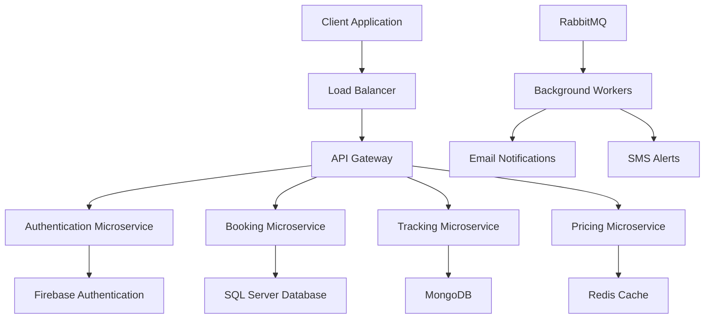

# 🚚 MoveMate Backend: Revolutionizing Relocation Technology


## 🌍 Market Context

In today's fast-paced urban landscape, moving is a complex challenge:
- 🏙️ **Growing Urban Mobility**: 65% increase in relocation services demand
- 💡 **Digital Transformation**: Traditional moving methods becoming obsolete
- 🔒 **Customer Pain Points**:
    - Lack of transparency
    - Inconsistent pricing
    - Poor tracking
    - Safety concerns
## 🎯 Problem We Solve

- **Traditional moving services face significant challenges**:
    - Lack of Transparency: Hidden fees and unclear processes.
    - Inconsistent Pricing: Variable costs across providers.
    - Poor Tracking: Limited ability to monitor moves in real-time.
    - Safety Concerns: Risky handling of personal belongings.
    - Limited Flexibility: Difficulty in adapting to customer needs

## 🚀 Our Solution: MoveMate Backend


### 💻 Technology Ecosystem

#### Core Technologies


- **Framework**: .NET 8
- **Architecture**: Clean, Microservices-based
- **Programming Paradigm**: Domain-Driven Design

#### Database Constellation


- **SQL Server**: Transactional Integrity
- **MongoDB**: Flexible Document Storage
- **Redis**: High-Performance Caching
- **Firestore**: Real-time Data Synchronization

#### Integration Powerhouse


- **Firebase**:
    - Authentication
    - Real-time Messaging
    - Cloud Notifications
- **RabbitMQ**: Message Queuing
- **Goong Map**: Geospatial Intelligence
- **Cloudinary**: Media Management
- **MailKit**: Communication Infrastructure

### DevOps & Monitoring


- **Docker**: Containerization
- **GitHub Actions**: Continuous Integration/Deployment
- **Grafana**: Performance monitoring
- **Hangfire**: Background job processing

#### Payment Gateways
- PayOS
- VNPay
- MoMo

### 🔧 System Architecture Highlights



### 🛡️ Security Architecture


#### Multi-Layered Security Approach
- JWT Token Authentication
- Firebase Multi-Factor Authentication
- Role-Based Access Control
- End-to-End Encryption
- Regular Security Audits

### 🚀 Performance Optimization Strategies

1. **Distributed Caching**
    - Redis for high-speed data retrieval
    - Intelligent cache invalidation
    - Reduced database load

2. **Asynchronous Processing**
    - Hangfire for background jobs
    - Non-blocking architecture
    - Improved response times

3. **Horizontal Scaling**
    - Containerized microservices
    - Kubernetes-ready design
    - Elastic infrastructure

### 📊 Monitoring & Observability


- **Grafana**: Comprehensive Performance Monitoring
- **Application Insights**: Detailed Telemetry
- **Custom Metrics**: Business-Specific KPIs

## 🛠️ Development Setup

### Prerequisites
- .NET 8 SDK
- Visual Studio 2022 / JetBrains Rider
- Docker Desktop
- Redis
- SQL Server

### Quick Start

1. Clone Repository
```bash
git clone https://github.com/CapstoneProjectFA24/movemate-system.git
cd movemate-system
```

2. Configuration
```json
{
  "ConnectionStrings": {
    "DefaultConnection": "Server={your_server};Database=MoveMateDB;"
  },
  "FirebaseConfig": {
    "ApiKey": "your_firebase_key",
    "AuthDomain": "your_auth_domain"
  }
}
```

3. Environment Setup
```bash
# Set environment variables
export JWT_SECRET=your_secret
export REDIS_CONNECTION=localhost:6379
export RABBIT_CONNECTION=localhost:15672
```

4. Database Migration
```bash
dotnet ef database update
```

5. Run Application
```bash
dotnet run
```

## 🌐 API Documentation

- **Swagger/OpenAPI**: https://api.movemate.info/swagger
- Interactive Endpoint Testing
- Comprehensive Documentation

## 🚀 Deployment Pipeline


- **Platform**: VPS Ubuntu
- **Containerization**: Docker
- **CI/CD**: GitHub Actions
- **Domain**: movemate.info

## 👥 Contribution Guidelines

1. Fork Repository
2. Create Feature Branch
3. Implement Changes
4. Write Tests
5. Submit Pull Request

## 📄 Licensing

**MIT License**: Open-source, commercial use permitted

## 📞 Contact
## 👥 Team Members

**MoveMate Group:**
- Cổ Phước Vinh - SE161891
- Đặng Nguyễn Hoài Phương - SE161958
- Phan Văn Tuấn - SE162029
- Nguyễn Thành Vinh - SE161950
- Lê Hàn Anh - SE161941

**Project Lead**: Vinh Co
- 📧 Email: cophuocvinh@gmail.com
- 🔗 Project Repository: https://github.com/CapstoneProjectFA24/movemate-system

---

**Reimagine Moving. Embrace Technology. Choose MoveMate! 🚚✨**